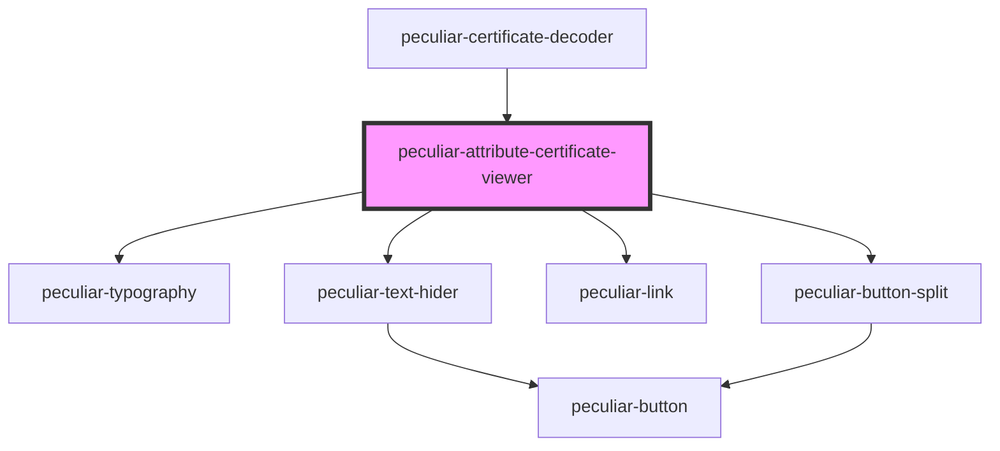

# peculiar-attribute-certificate-viewer

<!-- Auto Generated Below -->

## Properties

| Property                   | Attribute                      | Description                                                                                                                       | Type                                 | Default     |
| -------------------------- | ------------------------------ | --------------------------------------------------------------------------------------------------------------------------------- | ------------------------------------ | ----------- |
| `authKeyIdParentLink`      | `auth-key-id-parent-link`      | Authority Key Identifier extension parent link.   **NOTE**: `{{authKeyId}}` will be replaced to value from the extension.    | `string`                             | `undefined` |
| `authKeyIdSiblingsLink`    | `auth-key-id-siblings-link`    | Authority Key Identifier extension siblings link.   **NOTE**: `{{authKeyId}}` will be replaced to value from the extension.  | `string`                             | `undefined` |
| `certificate`              | `certificate`                  | The certificate value for decode and show details. Use PEM or DER.                                                                | `X509AttributeCertificate \| string` | `undefined` |
| `download`                 | `download`                     | If `true` - component will show split-button to download certificate as PEM or DER.                                               | `boolean`                            | `undefined` |
| `subjectKeyIdChildrenLink` | `subject-key-id-children-link` | Subject Key Identifier extension children link.   **NOTE**: `{{subjectKeyId}}` will be replaced to value from the extension. | `string`                             | `undefined` |
| `subjectKeyIdSiblingsLink` | `subject-key-id-siblings-link` | Subject Key Identifier extension siblings link.   **NOTE**: `{{subjectKeyId}}` will be replaced to value from the extension. | `string`                             | `undefined` |

## Dependencies

### Used by

 - [peculiar-certificate-decoder](../certificate-decoder)

### Depends on

- [peculiar-typography](../typography)
- [peculiar-text-hider](../text-hider)
- [peculiar-link](../link)
- [peculiar-button-split](../button-split)

### Graph

----------------------------------------------

