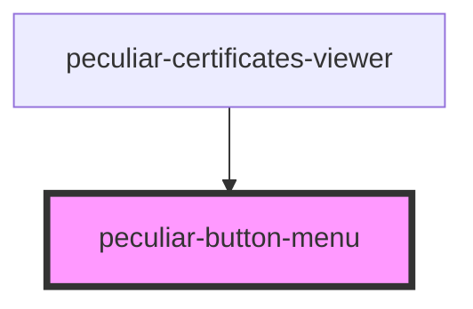

# peculiar-button-menu

<!-- Auto Generated Below -->

## Properties

| Property | Attribute | Description | Type                 | Default |
| -------- | --------- | ----------- | -------------------- | ------- |
| `groups` | --        |             | `IButtonMenuGroup[]` | `[]`    |

## Dependencies

### Used by

 - [peculiar-certificates-viewer](../certificates-viewer)

### Graph

----------------------------------------------

