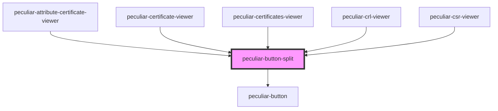

# peculiar-button-split

<!-- Auto Generated Below -->

## Properties

| Property  | Attribute | Description | Type                          | Default     |
| --------- | --------- | ----------- | ----------------------------- | ----------- |
| `actions` | --        |             | `IAction[]`                   | `[]`        |
| `fill`    | `fill`    |             | `"fill" \| "stroke"`          | `'stroke'`  |
| `onClick` | --        |             | `(event: MouseEvent) => void` | `undefined` |

## Dependencies

### Used by

 - [peculiar-attribute-certificate-viewer](../attribute-certificate-viewer)
 - [peculiar-certificate-viewer](../certificate-viewer)
 - [peculiar-certificates-viewer](../certificates-viewer)
 - [peculiar-crl-viewer](../crl-viewer)
 - [peculiar-csr-viewer](../csr-viewer)

### Depends on

- [peculiar-button](../button)

### Graph

----------------------------------------------

