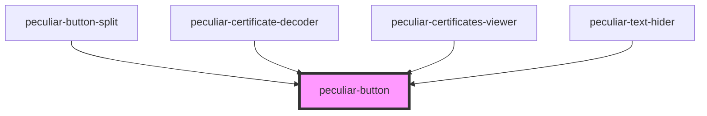

# peculiar-button

<!-- Auto Generated Below -->

## Properties

| Property   | Attribute  | Description                                                                                            | Type                                         | Default     |
| ---------- | ---------- | ------------------------------------------------------------------------------------------------------ | -------------------------------------------- | ----------- |
| `disabled` | `disabled` | Set to true to disable the button.                                                                     | `boolean`                                    | `undefined` |
| `fill`     | `fill`     |                                                                                                        | `"fill" \| "stroke"`                         | `'stroke'`  |
| `href`     | `href`     | When set, the underlying button will be rendered as an `<a>` with this `href` instead of a `<button>`. | `string`                                     | `undefined` |
| `onClick`  | --         |                                                                                                        | `(event: MouseEvent) => void`                | `undefined` |
| `target`   | `target`   | Tells the browser where to open the link. Only used when `href` is set.                                | `"_blank" \| "_parent" \| "_self" \| "_top"` | `undefined` |

## Shadow Parts

| Part      | Description |
| --------- | ----------- |
| `"base"`  |             |
| `"label"` |             |

## Dependencies

### Used by

 - [peculiar-button-split](../button-split)
 - [peculiar-certificate-decoder](../certificate-decoder)
 - [peculiar-certificates-viewer](../certificates-viewer)
 - [peculiar-text-hider](../text-hider)

### Graph

----------------------------------------------

