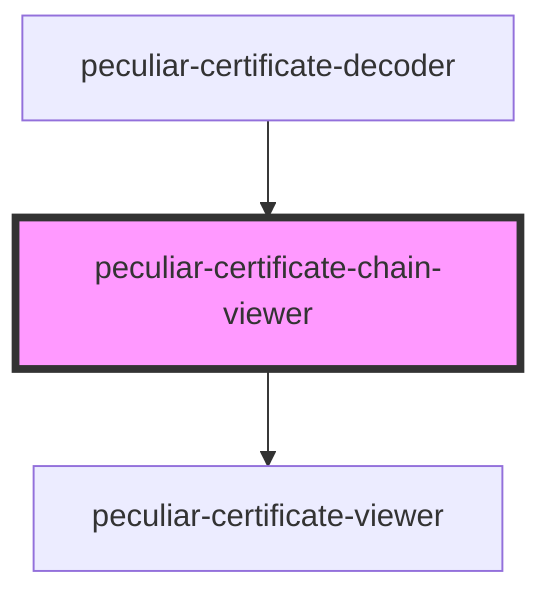

# peculiar-certificate-chain-viewer

<!-- Auto Generated Below -->

## Properties

| Property       | Attribute      | Description                                                                         | Type               | Default     |
| -------------- | -------------- | ----------------------------------------------------------------------------------- | ------------------ | ----------- |
| `certificates` | `certificates` | The certificate value for decode and show details. Use PEM or DER.                  | `X509Certificates` | `undefined` |
| `download`     | `download`     | If `true` - component will show split-button to download certificate as PEM or DER. | `boolean`          | `undefined` |

## Dependencies

### Used by

 - [peculiar-certificate-decoder](../certificate-decoder)

### Depends on

- [peculiar-certificate-viewer](../certificate-viewer)

### Graph

----------------------------------------------

