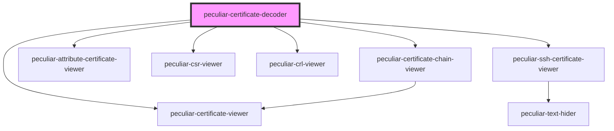

# peculiar-certificate-decoder

<!-- Auto Generated Below -->

## Properties

| Property              | Attribute               | Description                                                               | Type                                  | Default     |
| --------------------- | ----------------------- | ------------------------------------------------------------------------- | ------------------------------------- | ----------- |
| `certificateExamples` | --                      | Pre-loaded example certificates available in the "Load example" dropdown. | `{ title: string; value: string; }[]` | `undefined` |
| `certificateToDecode` | `certificate-to-decode` | A certificate to decode on first load (PEM or Base64 DER).                | `string`                              | `undefined` |

## Events

| Event              | Description                                              | Type                  |
| ------------------ | -------------------------------------------------------- | --------------------- |
| `clearCertificate` | Emitted when the input has been cleared.                 | `CustomEvent<void>`   |
| `successParse`     | Emitted when a certificate has been successfully parsed. | `CustomEvent<string>` |

## Dependencies

### Depends on

- [peculiar-certificate-chain-viewer](../certificate-chain-viewer)
- [peculiar-certificate-viewer](../certificate-viewer)
- [peculiar-attribute-certificate-viewer](../attribute-certificate-viewer)
- [peculiar-csr-viewer](../csr-viewer)
- [peculiar-crl-viewer](../crl-viewer)
- [peculiar-ssh-certificate-viewer](../ssh-certificate-viewer)

### Graph

```mermaid
graph TD;
  peculiar-certificate-decoder --> peculiar-certificate-chain-viewer
  peculiar-certificate-decoder --> peculiar-certificate-viewer
  peculiar-certificate-decoder --> peculiar-attribute-certificate-viewer
  peculiar-certificate-decoder --> peculiar-csr-viewer
  peculiar-certificate-decoder --> peculiar-crl-viewer
  peculiar-certificate-decoder --> peculiar-ssh-certificate-viewer
  peculiar-certificate-chain-viewer --> peculiar-certificate-viewer
  peculiar-ssh-certificate-viewer --> peculiar-text-hider
  style peculiar-certificate-decoder fill:#f9f,stroke:#333,stroke-width:4px
```

----------------------------------------------

