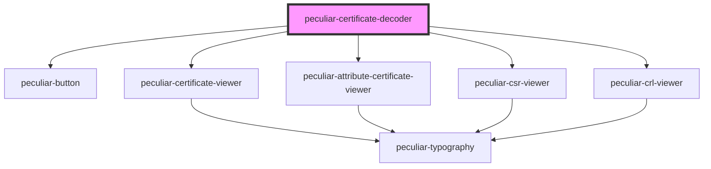

# peculiar-certificate-decoder

<!-- Auto Generated Below -->

## Properties

| Property             | Attribute             | Description                                                                | Type     | Default     |
| -------------------- | --------------------- | -------------------------------------------------------------------------- | -------- | ----------- |
| `certificateExample` | `certificate-example` | The example certificate value for decode and show details. Use PEM or DER. | `string` | `undefined` |
| `defaultCertificate` | `default-certificate` | The default certificate value for decode and show details. Use PEM or DER. | `string` | `undefined` |

## Events

| Event              | Description                                                | Type                  |
| ------------------ | ---------------------------------------------------------- | --------------------- |
| `clearCertificate` | Emitted when the certificate has been removed.             | `CustomEvent<void>`   |
| `successParse`     | Emitted when the certificate has been successfully parsed. | `CustomEvent<string>` |

## Dependencies

### Depends on

- [peculiar-button](../button)
- [peculiar-certificate-viewer](../certificate-viewer)
- [peculiar-attribute-certificate-viewer](../attribute-certificate-viewer)
- [peculiar-csr-viewer](../csr-viewer)
- [peculiar-crl-viewer](../crl-viewer)

### Graph

----------------------------------------------

