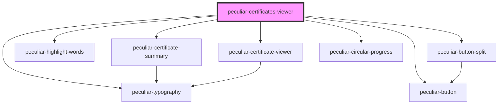

# peculiar-certificates-viewer

<!-- Auto Generated Below -->

## Properties

| Property              | Attribute               | Description                                                                                                                                                                                                                                                                                                                                                                                   | Type             | Default |
| --------------------- | ----------------------- | --------------------------------------------------------------------------------------------------------------------------------------------------------------------------------------------------------------------------------------------------------------------------------------------------------------------------------------------------------------------------------------------- | ---------------- | ------- |
| `certificates`        | --                      | List of certificates values for decode and show in the list.   **NOTE**: If you do not provide a `name` value when invocing the component it will take the first Subject CN value.   **NOTE**: If you do not provide a `tests` this column will be ommited from the rendered page.   **NOTE**: If the supplied certificates are self-signed the issuer column will be ommited. | `ICertificate[]` | `[]`    |
| `filterWithSearch`    | `filter-with-search`    | Use filter in the list when search is changed.                                                                                                                                                                                                                                                                                                                                                | `boolean`        | `true`  |
| `highlightWithSearch` | `highlight-with-search` | Use highlight chapters in the list when search is changed.                                                                                                                                                                                                                                                                                                                                    | `boolean`        | `true`  |

## Events

| Event          | Description                                            | Type                           |
| -------------- | ------------------------------------------------------ | ------------------------------ |
| `detailsClose` | Emitted when the user close certificate details modal. | `CustomEvent<void>`            |
| `detailsOpen`  | Emitted when the user open certificate details modal.  | `CustomEvent<X509Certificate>` |

## Shadow Parts

| Part                       | Description |
| -------------------------- | ----------- |
| `"presentation"`           |             |
| `"presentation_container"` |             |

## Dependencies

### Depends on

- [peculiar-certificate-summary](../certificate-summary)
- [peculiar-button](../button)
- [peculiar-typography](../typography)
- [peculiar-highlight-words](../highlight-words)
- [peculiar-button-split](../button-split)
- [peculiar-certificate-viewer](../certificate-viewer)
- [peculiar-circular-progress](../circular-progress)

### Graph

----------------------------------------------

