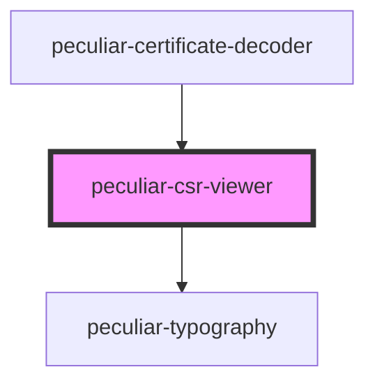

# peculiar-csr-viewer

<!-- Auto Generated Below -->

## Properties

| Property                   | Attribute                      | Description                                                                                                                       | Type            | Default     |
| -------------------------- | ------------------------------ | --------------------------------------------------------------------------------------------------------------------------------- | --------------- | ----------- |
| `certificate`              | `certificate`                  | The certificate value for decode and show details. Use PEM or DER.                                                                | `CSR \| string` | `undefined` |
| `download`                 | `download`                     | If `true` - component will show split-button to download certificate as PEM or DER.                                               | `boolean`       | `undefined` |
| `subjectKeyIdChildrenLink` | `subject-key-id-children-link` | Subject Key Identifier extension children link.   **NOTE**: `{{subjectKeyId}}` will be replaced to value from the extension. | `string`        | `undefined` |
| `subjectKeyIdSiblingsLink` | `subject-key-id-siblings-link` | Subject Key Identifier extension siblings link.   **NOTE**: `{{subjectKeyId}}` will be replaced to value from the extension. | `string`        | `undefined` |
| `view`                     | `view`                         | Choose view type instead @media.                                                                                                  | `"mobile"`      | `undefined` |

## Dependencies

### Used by

 - [peculiar-certificate-decoder](../certificate-decoder)

### Depends on

- [peculiar-typography](../typography)

### Graph

----------------------------------------------

