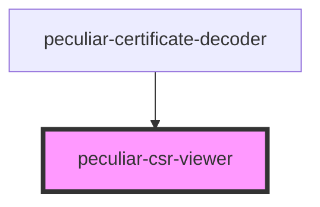

# peculiar-csr-viewer

<!-- Auto Generated Below -->

## Properties

| Property                   | Attribute                      | Description                                                                                                                                            | Type            | Default                |
| -------------------------- | ------------------------------ | ------------------------------------------------------------------------------------------------------------------------------------------------------ | --------------- | ---------------------- |
| `certificate`              | `certificate`                  | The certificate value for decode and show details. Use PEM or DER.                                                                                     | `CSR \| string` | `undefined`            |
| `download`                 | `download`                     | If `true` - component will show split-button to download certificate as PEM or DER.                                                                    | `boolean`       | `undefined`            |
| `mobileMediaQueryString`   | `mobile-media-query-string`    | Mobile media query string to control screen view change.   **NOTE**: Based on https://developer.mozilla.org/en-US/docs/Web/API/Window/matchMedia. | `string`        | `'(max-width: 900px)'` |
| `subjectKeyIdChildrenLink` | `subject-key-id-children-link` | Subject Key Identifier extension children link.   **NOTE**: `{{subjectKeyId}}` will be replaced to value from the extension.                      | `string`        | `undefined`            |
| `subjectKeyIdSiblingsLink` | `subject-key-id-siblings-link` | Subject Key Identifier extension siblings link.   **NOTE**: `{{subjectKeyId}}` will be replaced to value from the extension.                      | `string`        | `undefined`            |

## Dependencies

### Used by

 - [peculiar-certificate-decoder](../certificate-decoder)

### Graph

----------------------------------------------

