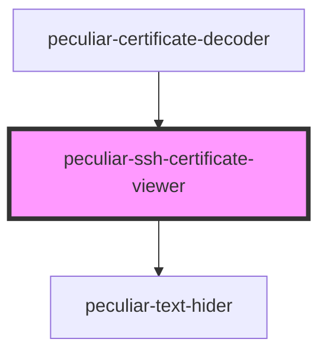

# peculiar-ssh-certificate-viewer

<!-- Auto Generated Below -->

## Properties

| Property                 | Attribute                   | Description                                                                                                                                            | Type                       | Default                |
| ------------------------ | --------------------------- | ------------------------------------------------------------------------------------------------------------------------------------------------------ | -------------------------- | ---------------------- |
| `certificate`            | `certificate`               | The certificate value for decode and show details. Use PEM or DER.                                                                                     | `SshCertificate \| string` | `undefined`            |
| `download`               | `download`                  | If `true` - component will show split-button to download certificate as PEM or DER.                                                                    | `boolean`                  | `undefined`            |
| `mobileMediaQueryString` | `mobile-media-query-string` | Mobile media query string to control screen view change.   **NOTE**: Based on https://developer.mozilla.org/en-US/docs/Web/API/Window/matchMedia. | `string`                   | `'(max-width: 900px)'` |

## Dependencies

### Used by

 - [peculiar-certificate-decoder](../certificate-decoder)

### Depends on

- [peculiar-text-hider](../text-hider)

### Graph

----------------------------------------------

