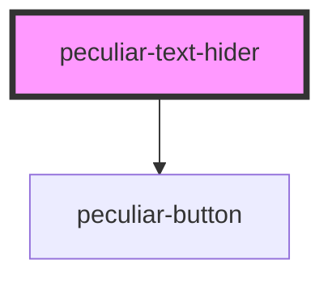

# peculiar-text-hider

<!-- Auto Generated Below -->

## Properties

| Property | Attribute | Description | Type      | Default |
| -------- | --------- | ----------- | --------- | ------- |
| `opened` | `opened`  |             | `boolean` | `false` |

## Events

| Event        | Description | Type               |
| ------------ | ----------- | ------------------ |
| `textExpand` |             | `CustomEvent<any>` |

## Dependencies

### Depends on

- [peculiar-button](../button)

### Graph

----------------------------------------------

