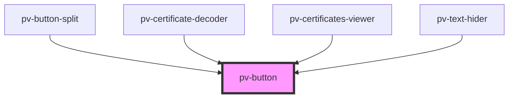

# pv-button

<!-- Auto Generated Below -->

## Properties

| Property   | Attribute  | Description | Type                 | Default     |
| ---------- | ---------- | ----------- | -------------------- | ----------- |
| `disabled` | `disabled` |             | `boolean`            | `undefined` |
| `fill`     | `fill`     |             | `"fill" \| "stroke"` | `'stroke'`  |
| `href`     | `href`     |             | `string`             | `undefined` |
| `target`   | `target`   |             | `string`             | `undefined` |

## CSS Custom Properties

| Name                        | Description                 |
| --------------------------- | --------------------------- |
| `--pv-button-padding-end`   | Right padding of the button |
| `--pv-button-padding-start` | Left padding of the button  |

## Dependencies

### Used by

 - [pv-button-split](../button-split)
 - [pv-certificate-decoder](../certificate-decoder)
 - [pv-certificates-viewer](../certificates-viewer)
 - [pv-text-hider](../text-hider)

### Graph

----------------------------------------------

