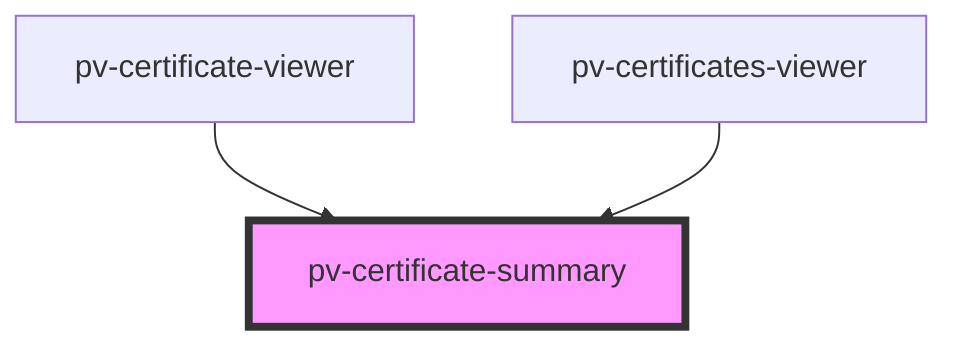

# pv-certificate-summary

<!-- Auto Generated Below -->

## Properties

| Property      | Attribute     | Description | Type          | Default     |
| ------------- | ------------- | ----------- | ------------- | ----------- |
| `certificate` | --            |             | `Certificate` | `undefined` |
| `showIssuer`  | `show-issuer` |             | `boolean`     | `true`      |

## Dependencies

### Used by

 - [pv-certificate-viewer](../certificate-viewer)
 - [pv-certificates-viewer](../certificates-viewer)

### Graph

----------------------------------------------

