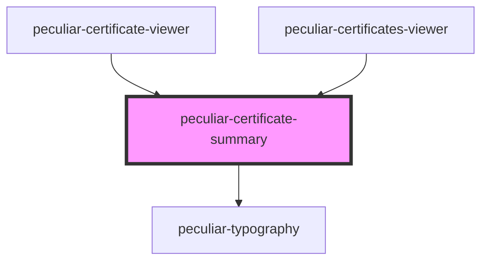

# peculiar-certificate-summary

<!-- Auto Generated Below -->

## Properties

| Property       | Attribute        | Description                                                              | Type              | Default     |
| -------------- | ---------------- | ------------------------------------------------------------------------ | ----------------- | ----------- |
| `certificate`  | --               |                                                                          | `X509Certificate` | `undefined` |
| `issuerDnLink` | `issuer-dn-link` | Issuer DN link. NOTE: HTML component attribute must be `issuer-dn-link`. | `string`          | `undefined` |
| `showIssuer`   | `show-issuer`    |                                                                          | `boolean`         | `true`      |
| `view`         | `view`           | Choose view type instead @media.                                         | `"mobile"`        | `undefined` |

## Dependencies

### Used by

 - [peculiar-certificate-viewer](../certificate-viewer)
 - [peculiar-certificates-viewer](../certificates-viewer)

### Depends on

- [peculiar-typography](../typography)

### Graph

----------------------------------------------

