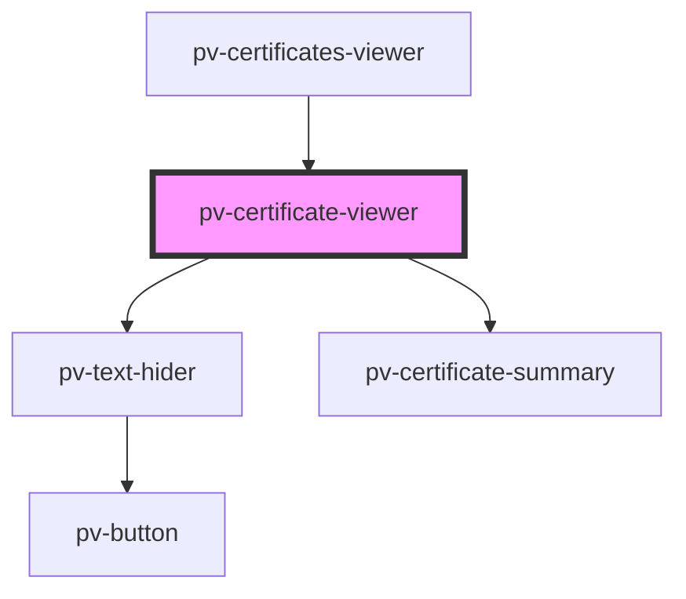

# pv-certificate-viewer

<!-- Auto Generated Below -->

## Properties

| Property      | Attribute     | Description | Type     | Default     |
| ------------- | ------------- | ----------- | -------- | ----------- |
| `certificate` | `certificate` |             | `string` | `undefined` |

## Dependencies

### Used by

 - [pv-certificates-viewer](../certificates-viewer)

### Depends on

- [pv-text-hider](../text-hider)
- [pv-certificate-summary](../certificate-summary)

### Graph

----------------------------------------------

*Built with [StencilJS](https://stenciljs.com/)*
