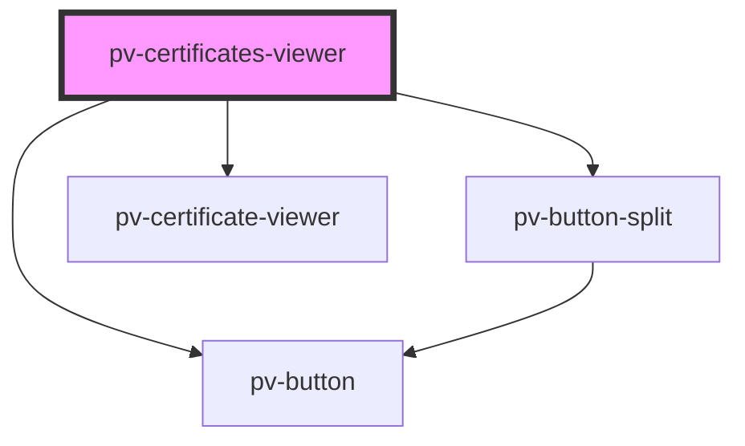

# pv-certificates-viewer

<!-- Auto Generated Below -->

## Properties

| Property       | Attribute      | Description | Type     | Default |
| -------------- | -------------- | ----------- | -------- | ------- |
| `certificates` | `certificates` |             | `string` | `''`    |

## Dependencies

### Depends on

- [pv-button](../button)
- [pv-button-split](../button-split)
- [pv-certificate-viewer](../certificate-viewer)

### Graph

----------------------------------------------

*Built with [StencilJS](https://stenciljs.com/)*
