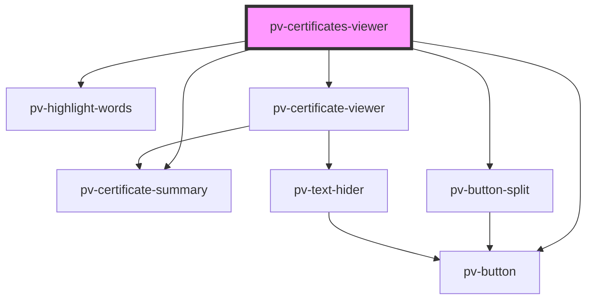

# pv-certificates-viewer

<!-- Auto Generated Below -->

## Properties

| Property              | Attribute               | Description                                                  | Type             | Default |
| --------------------- | ----------------------- | ------------------------------------------------------------ | ---------------- | ------- |
| `certificates`        | --                      | List of certificates values for decode and show in the list. | `ICertificate[]` | `[]`    |
| `filterWithSearch`    | `filter-with-search`    | Use filter in the list when search is changed.               | `boolean`        | `true`  |
| `highlightWithSearch` | `highlight-with-search` | Use highlight chapters in the list when search is changed.   | `boolean`        | `true`  |

## Dependencies

### Depends on

- [pv-certificate-summary](../certificate-summary)
- [pv-button](../button)
- [pv-highlight-words](../highlight-words)
- [pv-button-split](../button-split)
- [pv-certificate-viewer](../certificate-viewer)

### Graph

----------------------------------------------

