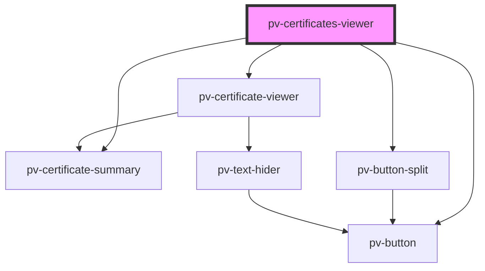

# pv-certificates-viewer

<!-- Auto Generated Below -->

## Properties

| Property       | Attribute | Description                                                  | Type             | Default |
| -------------- | --------- | ------------------------------------------------------------ | ---------------- | ------- |
| `certificates` | --        | List of certificates values for decode and show in the list. | `ICertificate[]` | `[]`    |

## Dependencies

### Depends on

- [pv-certificate-summary](../certificate-summary)
- [pv-button](../button)
- [pv-button-split](../button-split)
- [pv-certificate-viewer](../certificate-viewer)

### Graph

----------------------------------------------

