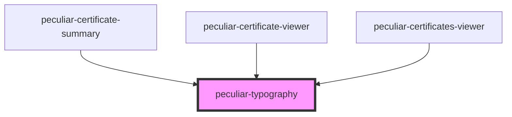

# peculiar-typography

<!-- Auto Generated Below -->

## Properties

| Property    | Attribute   | Description                                                                                 | Type                                                                    | Default     |
| ----------- | ----------- | ------------------------------------------------------------------------------------------- | ----------------------------------------------------------------------- | ----------- |
| `align`     | `align`     | Text align.                                                                                 | `"center" \| "left" \| "right"`                                         | `undefined` |
| `color`     | `color`     | Component color from theme.                                                                 | `"attention" \| "dark" \| "grey_3" \| "grey_5" \| "light" \| "primary"` | `'dark'`    |
| `ellipsis`  | `ellipsis`  | If `true`, the text will not wrap, but instead will truncate with a text overflow ellipsis. | `boolean`                                                               | `undefined` |
| `monospace` | `monospace` |                                                                                             | `boolean`                                                               | `undefined` |
| `type`      | `type`      | Typography type.                                                                            | `"b1" \| "b3" \| "h4" \| "h6" \| "h7"`                                  | `'b3'`      |

## Dependencies

### Used by

 - [peculiar-certificate-summary](../certificate-summary)
 - [peculiar-certificate-viewer](../certificate-viewer)
 - [peculiar-certificates-viewer](../certificates-viewer)

### Graph

----------------------------------------------

